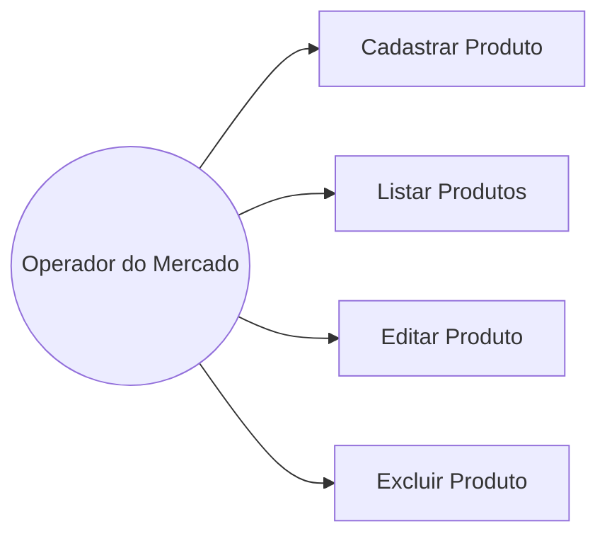

# Documentação de Caso de Uso

## Ator

- **Operador do Mercado**: pessoa responsável por gerenciar o estoque de
  produtos (única persona do sistema nesta versão).

## Ações que o ator pode realizar

- Cadastrar um novo produto no estoque.
- Listar/visualizar os produtos cadastrados.
- Editar os dados de um produto existente.
- Excluir um produto do estoque.

## Diagrama de Caso de Uso

## Descrição resumida de cada caso de uso

| Caso de uso        | Descrição                                                                 |
|---------------------|----------------------------------------------------------------------------|
| Cadastrar Produto   | O operador preenche o formulário com nome, categoria, descrição, preço, quantidade e validade, e o sistema insere o registro no banco. |
| Listar Produtos     | O sistema exibe todos os produtos cadastrados em uma tabela.              |
| Editar Produto      | O operador seleciona um produto existente, altera os dados desejados e o sistema atualiza o registro. |
| Excluir Produto     | O operador seleciona um produto e confirma a exclusão; o sistema remove o registro do banco. |
